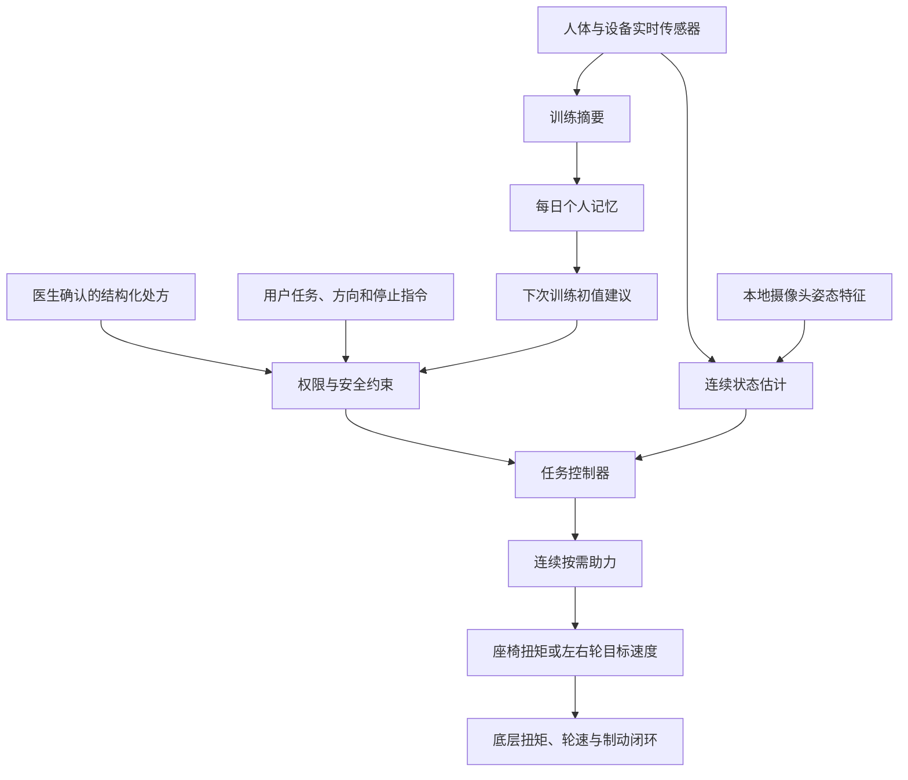

# RELAY 连续混合助力控制设计

**日期：** 2026-08-17
**状态：** 设计已确认，待实现计划
**硬件：** 旋转座椅助力轴 + 左右独立轮驱动
**替代范围：** 取代旧版 C1 中垂直减重轴、前后引导轴和步行减重假设。

## 1. 产品结论

### 目标患者

首版面向已经医生允许完全负重或按耐受负重、能够主动起立和迈步，但因以下术后状态出现下肢力量不足、负重不对称或稳定性下降的成人：

- 髋部骨折；
- 全髋或全膝关节置换；
- 已获准负重的下肢骨折。

首版不覆盖禁止负重、需要严格机械执行部分负重、不能主动迈步、需要连续体重减重或关节级步态驱动的患者。腰椎术后患者可作为后续研究人群，不是首发适应证。

### 三类任务

| 任务 | 是否计入康复 | 执行器职责 |
|---|---:|---|
| 主动坐站与受控坐下 | 是 | 旋转座椅提供最低必要助力和下降承托 |
| 室内主动跟随步行 | 是 | 左右轮跟随、转向、补偿设备滚阻并受控减速 |
| 坐姿电动运输 | 否 | 左右轮执行用户运输指令，数据与康复训练隔离 |

首版不进行轮端主动抗阻。步行进步表现为在相同低扶手交互力下走得更稳定、更远或更久，而不是让患者越来越用力推动设备。

### 核心原则

```text
医院处方许可
→ 用户主动发起
→ 实时估计动作进度和质量
→ 座椅只补足当前动作缺口
→ 质量良好时连续撤助
→ 助力接近零后增加有效训练剂量
```

处方与安全、主动参与、动作质量和训练剂量按上述顺序处理，不合并成可以互相抵消的总分。

## 2. 架构与权限



控制权限固定为：

```text
急停与硬件保护
> 机械锁止与配置许可
> 医生确认的处方
> 患者停止指令
> 本地安全监督
> 任务控制器
> 连续按需助力
> 每日参数建议
> Agent解释与导航建议
```

Agent、摄像头模型、云端服务和每日记忆均不能直接写电机命令。

### 时间尺度

| 层级 | 调度目标 | 内容 |
|---|---:|---|
| 执行器快速环 | 200-500 Hz | 座椅扭矩、轮速、电流、制动和硬件保护 |
| 人体任务环 | 50-100 Hz | 鞋垫、座面、扶手和 IMU 融合，助力计算 |
| 姿态补充环 | 摄像头有效帧率，通常 10-30 Hz | 关键点与代偿特征，不单独驱动执行器 |
| 会话与每日层 | 动作结束、稳定步行片段、每日一次 | 疲劳、个人基线、报告和下次初值 |

频率是架构目标，不是康复阈值；最终值根据执行器带宽、延迟和稳定性验证确定。Agent 或网络离线不得影响前两层运行。

## 3. 输入与状态

### 医院处方

有效处方至少包含：患侧、诊断/术式、允许任务、负重模式、适用的足底负荷上限、座椅角度/扭矩/速度范围、步行速度/转向率、疼痛与 RPE 限制、训练剂量和停止条件。

自然语言诊断或医嘱只能由 Agent 解析成候选字段，医生或康复师确认后才可生效。设备不得从患者表现自行推断骨愈合阶段。

### 传感器输入

| 输入 | 主要数据 | 控制用途 |
|---|---|---|
| 双侧压力鞋垫 | 双足负荷代理、压力中心、支撑时序 | 患侧参与、左右分配和处方反馈 |
| 座面四点压力 | 总载荷和压力中心 | 前移、卸载、离座、接触和坐稳 |
| 左右扶手多轴力 | 前后、垂直和侧向力 | 步行意图、差速转向、上肢代偿和失稳 |
| 腰骶、患侧大腿和小腿 IMU | 姿态、角速度和相对角 | 动作相位、髋膝运动和躯干稳定 |
| 本地摄像头 | 去身份化关键点、关节角和对称性 | 健侧与全身代偿补充 |
| 心率、RPE、疼痛 | 生理响应和主观耐受 | 会话疲劳与停止判断 |
| 腰部以下局部温度 | 温度趋势 | 健康观察，不进入实时助力 |
| 座椅反馈 | 角度、角速度、输出端扭矩、电流和温度 | 座椅闭环与设备/人体作用分离 |
| 左右轮反馈 | 两轮实际角速度、电流和制动状态 | 轮速闭环、转向和受控减速 |

原始视频只在本地处理，不上传；姿态特征可以进入每日记忆并供医生参考。扭矩传感器测到的是人体载荷、机构重力、摩擦和执行器作用的合成量，必须经过空载模型和校准。

每项数据必须带时间戳、单位、坐标系、校准版本、延迟、置信度和异常标记。

### 连续状态

- 坐站意图置信度：\(c_I(t)\in[0,1]\)；
- 坐站连续相位：\(\phi(t)\in[0,1]\)，0 为坐稳，1 为站稳；
- 动作进度：\(\dot\phi(t)\)；
- 患侧负荷与负荷冲量；
- 扶手水平推进和垂直卸载；
- 躯干、髋膝和全身姿态代偿；
- 步行意图、转向需求和实际轮速；
- 由动作衰减、姿态波动、心率恢复和 RPE 形成的疲劳趋势。

用户确认只提供任务许可。意图置信度由躯干前倾、座面压力转移、座面卸载和双足加载连续融合，不使用“命中两个传感器才启动”等无目标人群依据的固定计数规则。

### 执行器输出概览

| 执行器/执行元件 | 控制输出 | 主要计算依据 | 作用与边界 |
|---|---|---|---|
| 旋转座椅电机 | 目标输出扭矩 \(\tau_{motor}^{*}\)，受角度和速度范围限制 | 起立意图、坐站相位、动作进度、撤助许可、座椅角度/扭矩和医生处方 | 起立补力与坐下承托；患者离座后不再提供体重支撑 |
| 左右轮驱电机 | 左右轮目标角速度 \(\omega_L^*,\omega_R^*\)及加减速限制 | 左右扶手前后力、用户方向、实际轮速、稳定状态、环境和医生处方 | 主动跟随、差速转向、受控减速和坐姿运输；不输出主动抗阻 |
| 左右失效安全制动器 | 释放或施加制动 | 任务状态、实际轮速、驻车请求、急停、执行器故障和供电状态 | 驻车、故障保持和紧急接管；不作为康复训练输出 |

## 4. 旋转座椅连续助力

### 4.1 进度与质量分离

动作进度不足可以通过增加座椅助力改善；患侧参与不足、扶手代偿或姿态偏差不一定能通过增加助力改善。因此二者采用不同控制作用。

动作进度裕度：

\[
m_{progress}(t)=
\frac{\dot\phi(t)-\dot\phi_{safe}(\phi)}
{\sigma_{progress}}
\]

康复质量裕度分别计算：

| 裕度 | 含义 | 边界来源 |
|---|---|---|
| \(m_{participation}\) | 患侧负荷冲量是否保持 | 个人安全基线或康复师目标 |
| \(m_{hand}\) | 扶手卸载是否增加 | 个人安全基线 |
| \(m_{posture}\) | 躯干和关节代偿是否增加 | 个人安全姿态轨迹 |
| \(m_{fatigue}\) | 动作、心率和 RPE 是否恶化 | 个人安全会话基线 |
| \(m_{data}\) | 数据是否足以支持撤助 | 传感组合验证结果 |

所有裕度按测量误差和个人波动标准化，不使用统一姿态角、扶手力或起立速度阈值。连续撤助许可为：

\[
g_Q(t)=
\operatorname{clip}_{[0,1]}
\left(
\min\{m_{participation},m_{hand},m_{posture},m_{fatigue},m_{data}\}
\right)
\]

最差质量裕度接近个人边界时，\(g_Q\)连续趋近于零。良好指标不能抵消患侧参与不足、扶手代偿或姿态恶化。

患侧足底负荷超过医生明确给出的上限、疼痛越界、患者停止和硬件故障由独立安全层处理，不依赖普通自适应律。步行阶段当前机构只能监测并提示负重，不能机械强制减重。

### 4.2 扭矩输出

先分离设备自身补偿和人体助力：

\[
\tau_{motor}^{*}
=
\tau_{device}(\theta,\dot\theta)
+c_I(t)\alpha(t)\tau_{support}(\phi)
\]

- \(\tau_{device}\)：补偿座椅自重、摩擦和传动阻力，不计入康复助力；
- \(\tau_{support}(\phi)\)：监督标定得到的相位承托曲线；
- \(\alpha(t)\in[0,1]\)：连续助力比例。

助力连续变化：

\[
\dot\alpha=
\operatorname{Proj}_{[0,1]}
\left(
k_{up}[-m_{progress}]_+
-k_{down}[m_{progress}]_+g_Q
\right)
\]

其中 \([x]_+=\max(x,0)\)，并要求 \(k_{up}>k_{down}>0\)：

- 动作进度不足时连续增加助力；
- 进度充足且质量良好时缓慢撤助；
- 任一质量裕度不足时停止撤助，但不擅自增加扭矩；
- 增加保护快于撤除助力；
- 输出始终投影到处方与硬件允许范围。

具体增益、滤波和最大变化率没有通用临床数值，不在设计中写死，由机构辨识和验证确定。

### 4.3 受控坐下

\[
\tau_{desc}^{*}
=
\tau_{device}
+\alpha_{desc}\tau_{support,desc}(\phi)
+B_d[|\dot\theta|-\dot\theta_{safe}(\phi)]_+
\]

下降处于个人安全速度轨迹内时只提供最低支撑；下降过快时增加吸能扭矩。四点座面压力确认坐稳后，才逐步卸除承托并锁止座椅。

## 5. 左右轮主动跟随

### 步行模式

扶手前后合力和左右差力进入连续导纳模型：

\[
M_v\dot v+B_vv=F_{Lx}+F_{Rx}
\]

\[
J_\omega\dot\omega+B_\omega\omega=F_{Rx}-F_{Lx}
\]

其中 \(M_v,B_v,J_\omega,B_\omega>0\)。处方速度、转向率、加速度、障碍和安全监督对输出限幅。

\[
\omega_R^*=\frac{v+\frac b2\omega}{r},
\qquad
\omega_L^*=\frac{v-\frac b2\omega}{r}
\]

左右轮编码器闭环跟踪目标速度。扶手垂直力用于识别卸载和失稳，不能解释为前进意图。

轮端长期目标始终是低交互力跟随，不随康复进展降低滚阻补偿。患者停止施力时轮速应平滑衰减；失稳或停止指令触发受控减速。

### 坐姿运输

坐姿运输采用独立控制模式、速度范围和日志标签。轮速由用户运输指令和环境安全层决定，不使用步行导纳，也不更新康复能力。

## 6. 每日记忆与 Agent

每日记忆只接收有效康复任务的助力曲线、患侧负荷、扶手代偿、姿态、步行剂量、心率/RPE、数据质量和停止原因。运输数据、原始视频和无法区分照护者外力的数据不得进入能力基线。

下一次座椅初始助力为：

\[
\alpha_{0,d+1}(\phi)=
c_d\alpha_{safe,d}(\phi)
+(1-c_d)\alpha_{clinician}(\phi)
\]

\(c_d\)由确定性统计模块根据数据质量和不确定度计算。数据不足时，初值自动靠近康复师确认的保守曲线；结果始终投影到有效处方和设备范围。

Agent 可以解析医嘱候选字段、解释助力变化、生成趋势摘要和异常提示。Agent 不能修改处方、判断骨愈合、计算实时扭矩/轮速、扩大允许任务或根据局部温度诊断感染和血栓。

目前没有直接证据证明 Agent 记忆本身改善术后康复，因此它只负责记录、解释和保守参数初始化，不作为治疗机制宣传。

## 7. 安全与降级

### 必须写死的规则

只有具备明确医疗权限或物理依据的规则离散执行：任务模式互斥、用户许可与停止、处方上限、机械锁止、执行器限位、急停和关键故障。没有充分临床证据的人体表现变量保持连续。

### 故障处理

| 故障 | 处理 |
|---|---|
| 摄像头遮挡 | IMU继续工作，姿态不确定度增大，撤助速度趋近于零 |
| 心率、温度或 Agent 离线 | 实时控制继续，暂停相应趋势更新 |
| 单侧鞋垫异常 | 不更新负重基线；处方要求负重监测时停止训练 |
| 鞋垫、座面和 IMU 冲突 | 助力向最近安全曲线收敛 |
| 扶手传感器异常 | 步行轮速受控衰减至零 |
| 座面压力异常 | 禁止自动起立和坐下接触判定 |
| 座椅扭矩或角度异常 | 退出普通助力，机械保持或执行已验证的受控坐下 |
| 任一轮编码器异常 | 两轮同步减速，失效安全制动接管 |
| 网络中断 | 使用本地有效处方和安全参数，暂停 Agent |
| Agent 建议越界 | 确定性处方校验器拒绝 |

## 8. 理论依据与声明边界

| 设计环节 | 关键依据 | 支持结论 | 主要限制 |
|---|---|---|---|
| 骨科术后功能任务 | [Min 2021](https://doi.org/10.5535/arm.21110)、[Fairhall 2022](https://doi.org/10.1002/14651858.CD001704.pub5)、[Chaovalit](https://doi.org/10.1080/09638288.2018.1524518) | 坐站、平衡和步行属于有依据的功能训练 | 不决定本设备控制增益 |
| 座椅降低坐站需求 | [Janssen 2002](https://doi.org/10.1093/ptj/82.9.866)、[Rutherford](https://doi.org/10.3109/17483107.2014.921843)、[Fraiszudeen 2016](https://doi.org/10.1109/BIOROB.2016.7523703) | 座椅几何和抬升助力可降低髋膝机械需求 | 主要是生物力学或组件证据 |
| 坐站状态观测 | [Zijlstra 2012](https://doi.org/10.1186/1743-0003-9-75)、[Sato](https://doi.org/10.3109/17483107.2010.522682)、[Bhardwaj](https://doi.org/10.1080/17483107.2019.1629701) | IMU和压力可以识别坐站、离座与载荷转移 | 目标硬件仍需校准 |
| 足底负重反馈 | [Kammerlander 2018](https://doi.org/10.2106/JBJS.17.01222)、[Merkle 2023](https://doi.org/10.1186/s13018-023-03807-4) | 实时测量比仅靠患者主观执行更可靠 | 足底力不是骨或植入物载荷 |
| 按需辅助 | [Cao 2014](https://doi.org/10.1016/j.medengphy.2014.08.005)、[Duschau-Wicke 2010](https://doi.org/10.1109/TNSRE.2009.2033061)、[Fricke 2020](https://doi.org/10.1186/s12984-019-0630-9) | 最低必要、患者协作式辅助具有机制依据 | 临床优效性不一致 |
| 轮端导纳跟随 | [Itadera 2022](https://doi.org/10.1109/ICRA46639.2022.9811594)、[Sierra 2021](https://doi.org/10.3390/s21093242) | 主动轮可依据交互力跟随，高刚度会增加代偿 | 多为工程或神经康复研究 |
| 目标人群邻近平台 | [Costa 2022](https://doi.org/10.1109/TNSRE.2022.3175688) | 机器人助行康复可用于老年髋部骨折人群 | SWalker 不等同于当前设备 |
| 轮端主动抗阻 | [Mun 2017](https://doi.org/10.1007/s11517-017-1634-x) | 仅支持健康人短时肌肉激活变化 | 不足以证明骨科术后长期获益 |

理论上可以建立以下机制链：

```text
功能任务训练有临床依据
+ 座椅助力降低坐站需求
+ 实时传感器可观察参与和代偿
+ 连续按需辅助保留主动参与
+ 轮端导纳降低设备额外负担
= 当前算法具有合理康复作用机制
```

可以宣称组件机制和控制方向有依据；不能宣称完整设备已经被证明优于常规康复或保证所有患者恢复。
